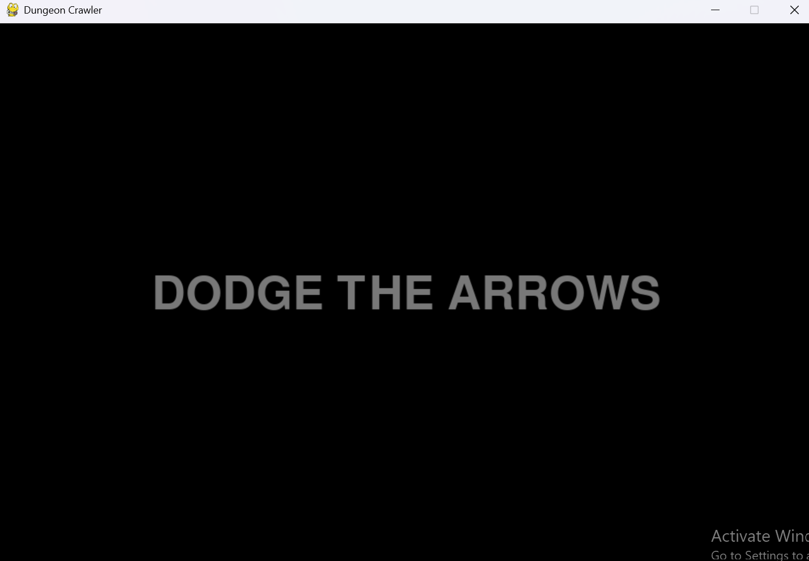
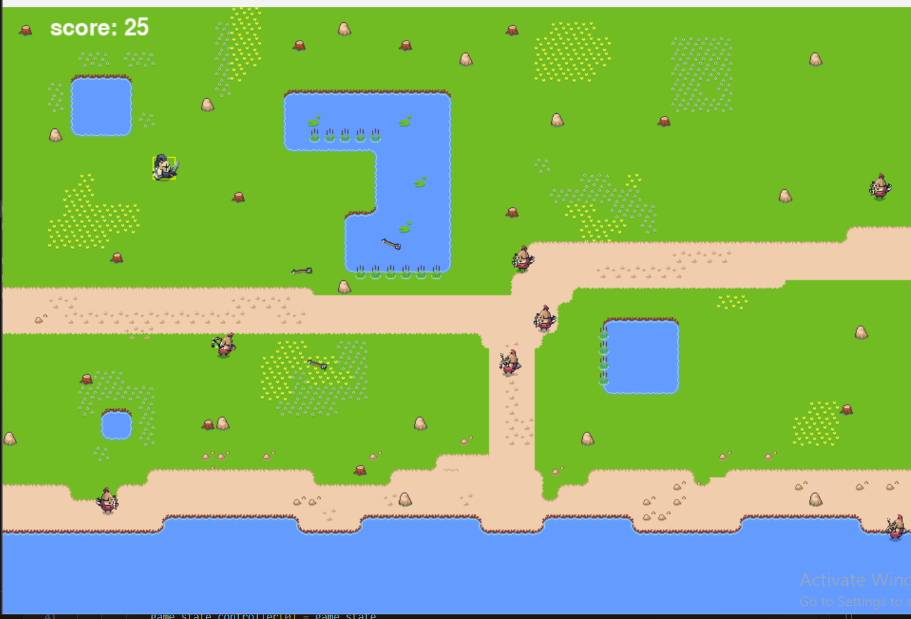
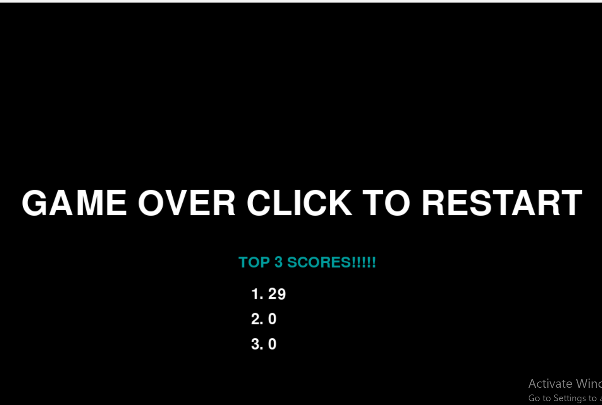

# Nkadi_Final_game
Class Project
## movement / controls
 - Use the arrow keys to move up, down, left, and right
 - use the spacebar to swing sword

## beginning of game
 - after the first image has faded click anywhere on the screen to start the game
 - once you are in the game press escape to exit the game or you can click on the screen again to restart 
 
 ## goal of the game
 - dodge the arrows coming at you from the archers
 - beware of the water as it slows you down significantly
 - score goes up the longer you survive try and survive for as long as possible

 ## images 
 
 
 
 